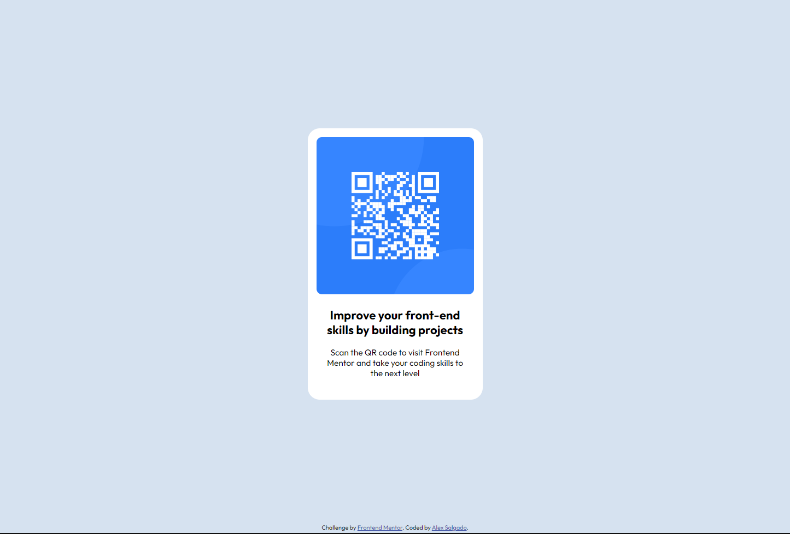

# Frontend Mentor - QR code component solution

This is a solution to the [QR code component challenge on Frontend Mentor](https://www.frontendmentor.io/challenges/qr-code-component-iux_sIO_H). Frontend Mentor challenges help you improve your coding skills by building realistic projects. 

## Table of contents

- [Overview](#overview)
  - [Screenshot](#screenshot)
  - [Links](#links)
- [My process](#my-process)
  - [Built with](#built-with)
  - [Continued development](#continued-development)
- [Author](#author)

## Overview

### Screenshot

### Links

- Solution URL: [Github solution](https://github.com/alexgsalg/frontendMentors-qrcode)
- Live Site URL: [Live on website](https://dromini.com.br/frontendmentors/qrcode/)

## My process

When I start a new project the first thing to do is try to break the design in pieces and think what the HTML5 tags to use. After that I focus on what type of structure is best for the grid layout and the responsive layout, what is the BEM nomenclature for the classes, if I'm using SASS or CSS and then I start to code the HTML template and styles.

### Built with

- Semantic HTML5 markup
- Flexbox
- CSS Grid

### Continued development

It's always good and fun to play with CSS and try to get as close as possible to the image provided, so this is something I'll always do and focus on improve.

## Author

- Website - [Alex Salgado](https://github.com/alexgsalg)
- Frontend Mentor - [@alexgsalg](https://www.frontendmentor.io/profile/alexgsalg)
